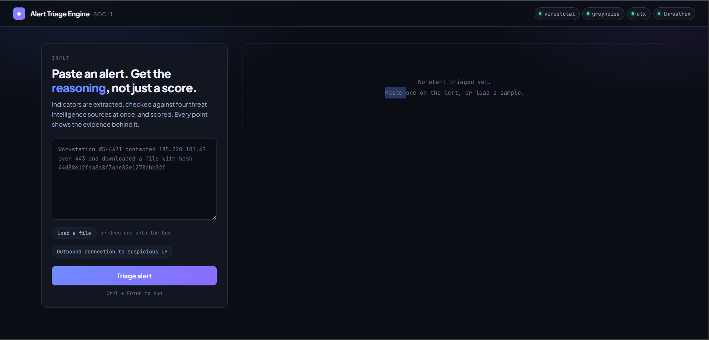
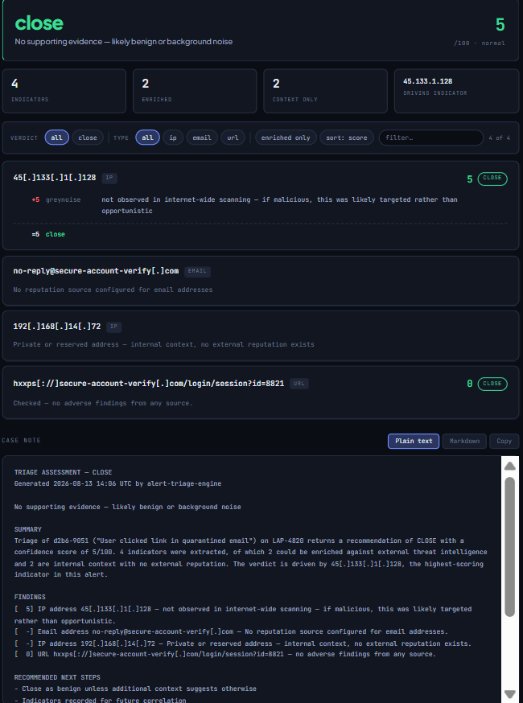

# Alert Triage Engine

**[Live demo →](https://alert-triage-engine.onrender.com/)**

[](https://www.python.org/)
[](https://fastapi.tiangolo.com/)
[](tests/)
[](LICENSE)

An L1 analyst opens an alert: *"Outbound connection to suspicious IP 185.220.101.47 from WS-4471."*

They open a browser tab, paste the IP into VirusTotal. Another tab, GreyNoise. Another, a threat intel platform. Eleven minutes later they close it as benign and move to the next of 339.

This tool does the lookups in parallel and returns a recommendation with the evidence attached — so the analyst spends their judgement on the decision instead of the copy-paste.

---

## The problem

The numbers on SOC alert volume are worse than most people expect:

- Organizations receive an average of **2,992 security alerts daily**, and **63% go unaddressed**.
- **46% of all alerts prove to be false positives** — in some enterprise SOCs that figure exceeds 50%.
- Excessive false positives consume **52% of analyst time**, and manual work that could be automated accounts for another **38%**.
- **73% of security teams** name false positives as their single biggest detection challenge.

Hiring more analysts doesn't solve it — there's a global shortage of around **4 million** cybersecurity professionals. And the tooling causes the problem by design: detection products are tuned to minimise misses at the cost of noise, because a missed breach is worse than a wasted hour. The cost lands entirely on the analyst.

The real damage isn't wasted time. It's the **"cry wolf" effect** — after hundreds of false alarms, analysts psychologically de-prioritize *all* alerts, including the real ones. A genuine intrusion arrives looking exactly like the 200 benign alerts before it and gets closed in forty seconds by someone who has been pattern-matching all afternoon.

**Alert fatigue isn't an HR problem. It's an attack surface.**

---

## What it does

```
alert → extract IOCs → enrich (4 sources, concurrent) → score → verdict + case note
```

1. **Extract** — finds IPs, domains, URLs, file hashes and email addresses in structured fields *and* free text
2. **Enrich** — queries four threat intelligence sources concurrently, with caching and per-source failure containment
3. **Score** — combines the evidence into a 0–100 score, where every point carries the sentence that justifies it
4. **Recommend** — escalate / investigate / monitor / close, plus a ticket-ready case note

---

## Why four sources

Each answers a different question, and **the disagreement between them is the signal**.

| Source | Question it answers | Covers |
|---|---|---|
| **VirusTotal** | What do ~70 AV engines say? | hashes, IPs, domains, URLs |
| **GreyNoise** | Is this IP just internet background noise? | IPs |
| **AlienVault OTX** | Which published threat campaigns reference this? | all types |
| **ThreatFox** | Is this tied to a known malware family? | all types |

GreyNoise is the one that does the most work, and it's the only source that can *subtract*:

```
IP flagged by reputation sources  +  GreyNoise: internet-wide scanner
    → hit 50,000 networks the same day. Noise. Deprioritize.

IP flagged by reputation sources  +  GreyNoise: never observed scanning
    → this one came for YOU. Escalate.
```

Same reputation score, opposite verdicts. That's the highest-volume false positive category in any SOC, and no single source can tell you which case you're in.

Noise **downgrades** rather than clears, though — a mass scanner can still deliver a payload to a vulnerable host.

---

## The signal ledger

The core design decision: **the verdict isn't the output — the arithmetic is.**

Any tool can print `ESCALATE`. What makes this one usable is that an analyst can see every point added and subtracted, and disagree with a single line in five seconds.

```
185[.]220[.]101[.]47                                      ip

  +50   virustotal   15/91 engines flag this as malicious
  +30   otx          referenced in 50 published threat reports —
                     including "SSH Brute-Force Honeypot Live"
  +25   greynoise    classified as malicious scanning activity
  −15   greynoise    also seen scanning indiscriminately —
                     opportunistic rather than targeted
   +8   virustotal   3 engines mark this suspicious
  ─────────────────────────────────────────────────────────────
  =98   escalate
```

Note the two GreyNoise lines. Both facts are true and both matter: it *is* malicious, and it *is* hitting everyone. An analyst needs both to judge whether this represents targeting or background radiation.

A bare "98" would be unarguable, which makes it useless.

---

## Screenshots






---

## Design decisions worth explaining

**No auto-close, ever.** The engine produces a *recommendation* with its evidence attached; a human clicks the button. A tool that silently closes alerts is one bad heuristic away from hiding a real intrusion.

**Four verdicts, not two.** `investigate` and `monitor` exist because forcing a binary call on ambiguous evidence is worse than admitting uncertainty. "Needs review" is a legitimate outcome, not a failure.

**Missing data is not clean data.** An unavailable source is recorded as `None`, never `0.0`, and the UI shows a reduced-confidence banner listing what couldn't be reached. A rate-limited lookup didn't say the indicator was safe — it said nothing.

**The worst indicator drives the verdict, not the average.** One confirmed malicious hash among ten clean indicators is still a confirmed malicious hash. Averaging would dilute exactly the signal that matters.

**Specific indicators outrank general ones.** A hash identifies exact bytes; an IP identifies a location that can host anything. When they disagree, the hash wins.

**Private IPs are kept but not enriched.** `10.4.12.88` tells the analyst which internal host was involved, which is useful. It has no external reputation because that address exists in millions of networks simultaneously, so looking it up would waste quota on a guaranteed empty result.

---

## Architecture

```
                    ┌──────────────────┐
                    │   Browser UI     │
                    └────────┬─────────┘
                             │ HTTP
                    ┌────────▼─────────┐
                    │  FastAPI (api.py)│  rate limiting, validation
                    └────────┬─────────┘
                             │
   ┌─────────────────────────▼─────────────────────────┐
   │                  engine (src/)                    │
   │  extract → intel → score → casenote               │
   └───────────────────────────────────────────────────┘
```

The engine knows nothing about the web. `api.py` is a thin wrapper over the same functions the test suite calls, which is why all 34 tests run without a server or a network connection.

```
alert-triage-engine/
├── src/
│   ├── config.py       thresholds, SLAs, credentials from env
│   ├── extract.py      IOC extraction, validation, defanging
│   ├── intel.py        async clients for four sources + caching
│   ├── score.py        additive scoring with per-signal rationale
│   ├── casenote.py     prose generation, plain text and markdown
│   └── api.py          FastAPI layer
├── static/
│   └── index.html      single-file UI, no build step
├── tests/              34 unit tests
├── data/samples/       synthetic alerts, safe to run
└── render.yaml         deployment config
```

---

## Technical notes

**Concurrency.** Four sources per indicator, run sequentially, is four round trips of waiting. `httpx` with `asyncio.gather` fires them together and waits for the slowest — turning ~1.5s into ~0.5s per indicator. VirusTotal's free tier allows 4 requests/minute, so VT calls specifically are capped by a semaphore while the others stay fully concurrent.

**Caching.** Results are cached for 24 hours, keyed by a hash of the indicator. Attacker infrastructure gets reused and benign noise sources are always the same, so hit rates are high in practice. A cold lookup takes ~15s; a cached one is instant.

**Graceful degradation.** Every source call is individually contained. A rate limit, timeout or malformed response marks that source unavailable and the verdict is still produced from the rest — with the gap surfaced to the analyst rather than hidden.

**Regex finds candidates; Python validates them.** A version string like `2.1.4.7` is structurally identical to an IPv4 address, and `ipaddress.ip_address()` accepts it as valid. There is no regex that fixes this, because the difference is context. The extractor filters by surrounding words and reserved ranges, and the UI lets analysts dismiss what slips through — pretending extraction is perfect would be worse.

---

## Security considerations

**API keys never touch the repo.** Credentials are read from environment variables, `.env` is gitignored, and `.env.example` documents what's needed without leaking anything.

**File loading happens in the browser.** Dropped files are read client-side with `FileReader` and their text is posted to the existing endpoint. Nothing is uploaded, so there is no server-side file handling to get wrong — no temp files, no path traversal, no filesystem writes. Choosing not to build the risky version *is* the security decision.

**Rate limiting protects the quota.** A public endpoint that spends your API credentials is a real vulnerability. Requests are capped per client IP, with an error message that points people at the repo to run it themselves.

**Input is capped at every boundary.** 50,000 characters per request, 25 indicators per alert, 500KB per file. Without those, one pasted log dump exhausts a daily quota.

**Indicators are defanged in output.** Case notes render `hxxp[://]evil[.]example[.]com` so they're safe to paste into a ticket, chat or email without creating a clickable link to malicious infrastructure.

---

## Limitations

**This operates at the bottom of the Pyramid of Pain.** IOCs — hashes, IPs, domains — are the cheapest indicators for an attacker to rotate. Recompiling malware changes the hash in thirty seconds; moving to a new VPS takes minutes. This is a triage accelerator for high-volume alerts, not a detection strategy on its own. The layers that actually hurt attackers are tools and TTPs, and those need behavioural detection.

**Reputation reflects what was known at lookup time.** Newly registered infrastructure frequently has no reputation yet, so an absence of findings is much weaker evidence than a positive finding.

**No sandbox, no static analysis.** A hash nobody has seen before returns nothing, regardless of what the file does.

**Scoring thresholds are a policy, not a fact.** The weights in `config.py` are defensible starting points, not anyone's tuned production values. A real deployment would tune them against its own alert volume and team capacity.

**Extraction has a false positive rate.** See the version-string problem above. The UI surfaces every extracted indicator so an analyst can dismiss what's wrong, rather than the tool pretending it got them all right.

---

## Running it

Requires Python 3.12+ and free API keys from [VirusTotal](https://virustotal.com), [GreyNoise](https://greynoise.io), [OTX](https://otx.alienvault.com) and [abuse.ch](https://auth.abuse.ch).

```bash
git clone https://github.com/YOUR-USERNAME/alert-triage-engine.git
cd alert-triage-engine

python -m venv venv
source venv/bin/activate        # Windows: .\venv\Scripts\Activate.ps1
pip install -r requirements.txt

cp .env.example .env            # then fill in your four keys
uvicorn src.api:app --reload
```

Open `http://127.0.0.1:8000`. Interactive API docs at `/docs`.

```bash
pytest -v     # 34 tests, no network or credentials needed
```

The test suite runs offline because the engine is separable from its data sources — worth noting if you want to read the scoring logic without registering for anything.

### API

```bash
curl -X POST http://127.0.0.1:8000/api/triage \
  -H "Content-Type: application/json" \
  -d '{"raw_text": "Host contacted 185.220.101.47 and downloaded 44d88612fea8a8f36de82e1278abb02f"}'
```

| Endpoint | Purpose |
|---|---|
| `POST /api/triage` | Triage an alert (structured object or raw text) |
| `GET /api/health` | Which intel sources have credentials configured |
| `GET /api/samples` | Bundled sample alerts |
| `GET /docs` | Interactive OpenAPI documentation |

---

## Testing

34 unit tests covering extraction edge cases and scoring logic.

The extraction tests matter because that stage is where false positives originate — everything downstream inherits whatever it decides is an indicator. So the awkward cases get the coverage: version strings that look like IPs, filenames that look like domains, SHA256 hashes containing valid MD5 substrings, defanged input, private address ranges.

The scoring tests exist for a specific reason: several branches never execute against real sample data. GreyNoise's RIOT classification, the degraded-source path, the lower verdict bands. Rather than hunting for sample alerts that happened to trigger them, those paths are covered with constructed source results — which is the correct way to test a branch regardless.

Two of those tests found a real bug: the VirusTotal score cap sat *below* the escalate threshold, meaning overwhelming AV consensus alone could never escalate. That would never have surfaced from the sample data, because those alerts had multiple sources contributing.

---

## What I learned

I expected this to be an API integration problem. It's mostly a **judgement** problem — deciding what a signal means when sources disagree, and being honest in the output about what the engine doesn't know.

The clearest example: an IP with 89 abuse reports and a 100% confidence score sounds alarming until GreyNoise tells you it scans the entire internet. The reports exist *because* it scans everyone. The two sources aren't contradicting each other; one is explaining the other. I got that backwards at first and reasoned my way to "block it anyway, don't take the risk" — which is exactly the reflex that produces alert fatigue in the first place.

The other thing that took a while to internalise: **a tool that escalates everything is worse than no tool.** It adds work while providing no filtering. Building something whose job is partly to say "this is nothing" required accepting that the tool will sometimes be wrong in that direction, and designing so a human can catch it.

---

## Future improvements

- **Sandbox integration** for hashes with no existing reputation — the current blind spot
- **Bulk mode** — a queue of alerts triaged in one pass, ranked by verdict
- **Historical correlation** — flag when an indicator has appeared in previous alerts
- **A second alert parser** for `.eml` files with SPF/DKIM/DMARC checks, since phishing is the highest-volume alert type in most SOCs

---

## Disclaimer

Built as a learning project. It's not production-hardened and hasn't been tested at SOC scale. Verdicts are automated recommendations based on external threat intelligence lookups — not determinations that a host is compromised. Analyst judgement is required before acting on anything it says.

> The live demo runs on Render's free tier, so the first request after a period of inactivity takes 30–60 seconds while the instance wakes. It's also rate-limited, since it runs on free threat intelligence quotas.

Intelligence sources: [VirusTotal](https://www.virustotal.com), [GreyNoise](https://www.greynoise.io), [AlienVault OTX](https://otx.alienvault.com) and [ThreatFox](https://threatfox.abuse.ch) by abuse.ch — all used within their free-tier terms.