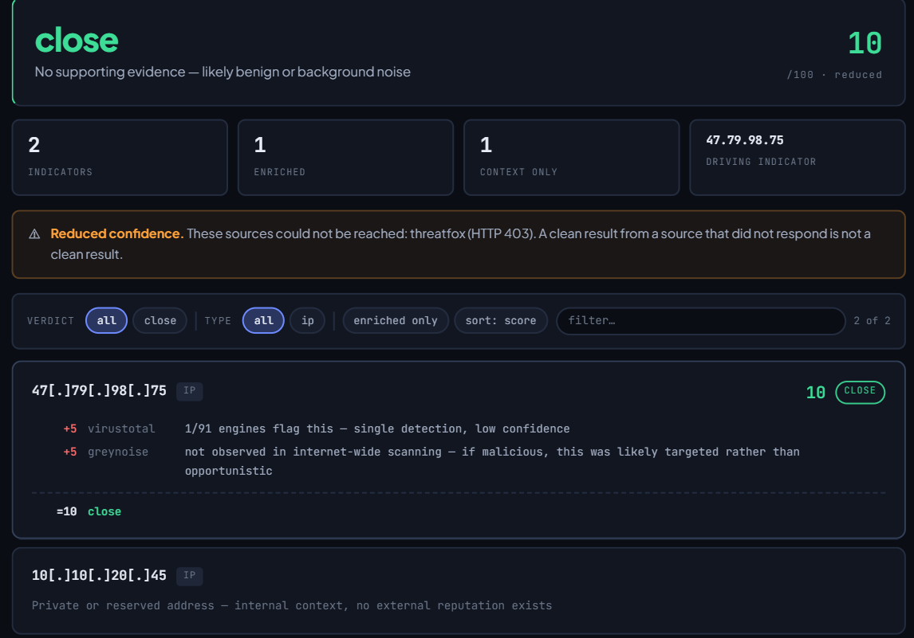
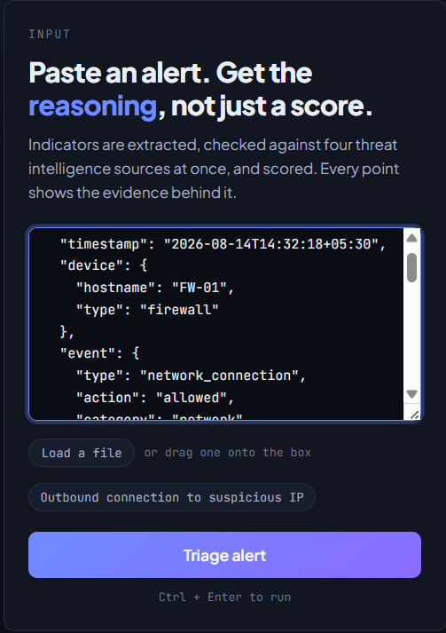
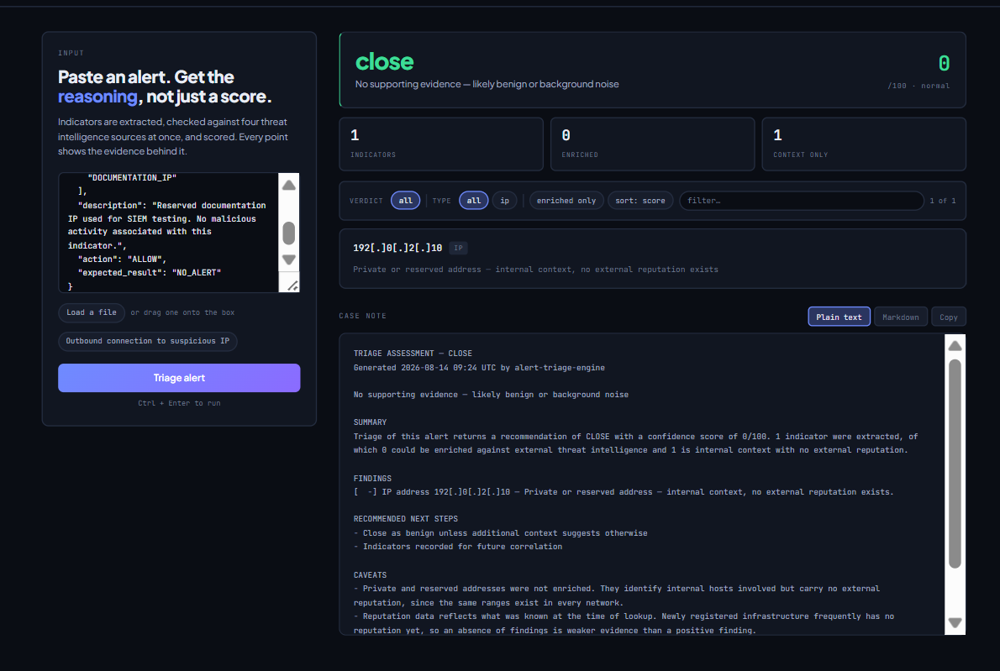
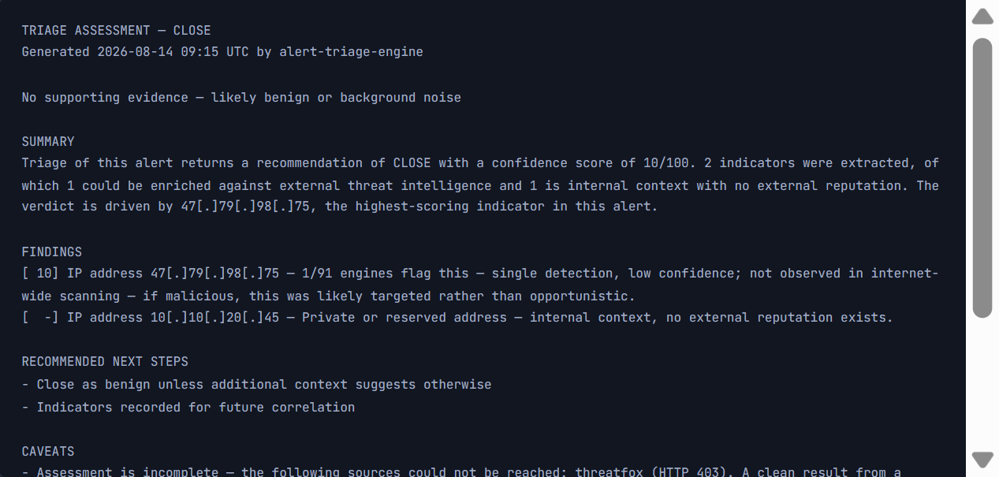

# Alert Triage Engine

Automated first-pass triage for security alerts — extracts indicators of compromise from raw alert text, enriches them against four threat intelligence sources concurrently, scores the result, and produces an analyst-ready case note.

**Live demo:** https://alert-triage-engine.onrender.com/

> Hosted on Render's free tier — the first request after a period of inactivity takes ~50 seconds to wake the instance. Subsequent requests are fast.



---

## The problem

A Tier 1 SOC analyst receives an alert containing an IP address, a domain, or a file hash. To decide whether it matters, they open a browser tab for VirusTotal, another for GreyNoise, another for OTX, check ThreatFox, then manually reconcile four sets of results into a judgement. That loop takes several minutes and repeats dozens of times a shift.

The lookups themselves are mechanical. The judgement is not. This tool automates the mechanical half so the analyst's attention goes to the part that actually needs a human — and leaves an audit trail of exactly which sources said what.

---

## What it does

- **Extracts IOCs** from unstructured alert text — IPv4 addresses, domains, URLs, and file hashes — using pattern matching with defanging support
- **Enriches concurrently** against VirusTotal, GreyNoise, AlienVault OTX, and ThreatFox, so total latency is roughly the slowest single source rather than the sum of all four
- **Caches responses** to avoid burning free-tier API quota on repeated lookups of the same indicator
- **Degrades gracefully** — a source that times out, rate-limits, or errors is reported as unavailable rather than silently treated as clean
- **Scores each indicator** through a transparent signal ledger that shows which source contributed what to the final verdict
- **Generates a case note** in analyst-ready form, suitable for pasting into a ticket or a shift handover
- **Rate-limits per IP** on the enrichment endpoint to protect the upstream API keys

---

## Screenshots

| | |
|---|---|
|  |  |
| Paste raw alert text — no structured format required | A clean indicator: the engine discriminates rather than flagging everything |



The case note is the actual deliverable. Everything upstream of it exists to produce something an analyst can put in a ticket.

---

## Architecture

```
                    Alert text (unstructured)
                              │
                              ▼
                     ┌────────────────┐
                     │ IOC extractor  │  pattern matching + defang handling
                     └────────────────┘
                              │
                              ▼
                     ┌────────────────┐
                     │  Cache check   │
                     └────────────────┘
                              │  (miss)
                              ▼
              ┌───── async enrichment fan-out ─────┐
              │                                    │
        ┌─────┴─────┐  ┌──────────┐  ┌─────┐  ┌───┴──────┐
        │VirusTotal │  │GreyNoise │  │ OTX │  │ThreatFox │
        └─────┬─────┘  └────┬─────┘  └──┬──┘  └───┬──────┘
              │             │           │         │
              └─────────────┴─────┬─────┴─────────┘
                                  ▼
                        ┌──────────────────┐
                        │  Signal ledger   │  per-source contribution
                        └──────────────────┘
                                  │
                                  ▼
                        ┌──────────────────┐
                        │ Verdict + case   │
                        │      note        │
                        └──────────────────┘
```

API keys are held server-side in environment variables and are never exposed to the browser. Rate limiting sits in front of the enrichment endpoint, before any upstream call is made.


### Data flow

1. Client submits raw alert text to the FastAPI backend
2. Backend validates and size-limits the input, then extracts candidate indicators
3. Per-IP rate limit is checked before any upstream request
4. Cache is consulted; only cache misses reach the threat intel APIs
5. Enrichment requests fan out concurrently; each is independently timeout-bounded
6. Results are normalised into a common shape and scored
7. Verdict, signal ledger, and case note are rendered

---

## Technology stack

| Choice | Why |
|---|---|
| Python | Dominant language for security tooling; strong HTTP and parsing ecosystem |
| FastAPI | Native async support, which the concurrent enrichment design depends on; request validation and schema handling come built in |
| Async HTTP client | Four independent network calls that don't depend on each other — running them sequentially would triple response time for no benefit |
| Server-rendered templates | The UI is a thin presentation layer over the API; a client-side framework would add build complexity without adding capability |
| Render | Free tier sufficient for a public demo, with environment-variable secret storage and automatic deploys from GitHub |
| pytest | Unit coverage for the logic that must not silently break — extraction and scoring |

**Considered and rejected:** a database. The tool is stateless by design and stores no alerts, so persistence would add an attack surface and an operational burden with no functional gain at this scope.

---

## Security design decisions

Each decision is stated with the risk it addresses and what it cost.

### Server-side API key storage

**Decision:** All four API keys live in server-side environment variables, loaded at startup. No key is ever sent to the browser.

**Why:** Any credential reachable by client-side code is a public credential. A key in frontend JavaScript can be read from the page source, and free-tier threat intel quotas are exhaustible — an exposed key is both a confidentiality problem and a denial-of-service problem for the tool itself.

**Trade-off:** Every enrichment request must round-trip through the backend. Slightly higher latency than calling the APIs directly from the browser, in exchange for the keys staying secret.

### Per-IP rate limiting on the enrichment endpoint

**Decision:** The enrichment endpoint enforces a per-source-IP request limit.

**Why:** The endpoint is unauthenticated and public. Without a limit, anyone could point a script at it and use my API quota as their own free threat intel proxy, exhausting the daily allowance and taking the demo offline for everyone else. This is resource abuse rather than data theft — the asset being protected is quota, not information.

**Trade-off:** A shared corporate NAT or university gateway could see multiple legitimate users share one apparent IP and hit the limit collectively.

### No authentication — a deliberate choice

**Decision:** The application has no user accounts, no login, and no sessions.

**Why:** Authentication exists to protect something — stored data, user-specific state, privileged actions. This application has none of those. It holds no user records, persists no submitted alerts, and every user gets identical functionality. Adding a login here would mean storing credentials, which creates a genuine breach consequence where none currently exists. Rate limiting is the compensating control for the abuse risk that does exist.

**Trade-off:** The service cannot attribute usage, cannot offer per-user quotas, and cannot be deployed as-is inside an organisation.

**Before this handled real production alerts it would need:** authentication with hashed credentials, per-user rate limits and audit logging, and encryption of stored alert data — because at that point the alerts themselves become sensitive material describing an organisation's internal network.

### Input validation and size limiting

**Decision:** Submitted text is length-bounded and validated before parsing.

**Why:** Unbounded input to a regex-based extractor is a denial-of-service vector — a large or adversarially constructed payload can consume disproportionate CPU. Bounding the input caps the worst case.

**Trade-off:** Very large alert dumps must be split before submission.

### Fail-visible, not fail-open

**Decision:** When an enrichment source errors, times out, or rate-limits, it is reported explicitly as unavailable and is excluded from scoring rather than counted as a clean result.

**Why:** This is the most consequential decision in the project. If a failed VirusTotal lookup were treated as "nothing found," an API outage would silently turn every malicious indicator benign — a security tool confidently producing wrong answers. Visible degradation is recoverable; silent degradation is not.

**Trade-off:** The analyst sometimes sees a partial verdict and has to complete the check manually. That is the correct outcome.

---

## Threat model

Assets: the four API keys, service availability, and the integrity of the verdict.

| Threat (STRIDE) | Scenario | Mitigation |
|---|---|---|
| Information disclosure | Attacker extracts API keys from client-side code or error output | Keys held server-side only; errors returned to the client are generic and do not include upstream response bodies |
| Denial of service | Automated abuse exhausts free-tier API quota, disabling the tool | Per-IP rate limiting; response caching reduces upstream calls |
| Denial of service | Oversized or adversarial input causes excessive parsing cost | Input length bounds and validation before extraction |
| Tampering | Malformed input manipulates extraction to produce a false verdict | Strict indicator pattern matching; unmatched content is discarded rather than passed through |
| Spoofing | Upstream source is unreachable and its silence is read as "clean" | Fail-visible design — unavailable sources are excluded from scoring and shown as unavailable |
| Repudiation | No record of who submitted what | **Accepted, not mitigated** — the service is anonymous by design and stores nothing. Would require authentication and audit logging to address |

---

## Limitations — what this is not

- **It does not ingest from a SIEM.** Alerts are pasted manually. Real deployment would need a connector to pull from the alert queue.
- **It is single-tenant and stateless.** No case history, no assignment, no analyst workflow — this is the enrichment step, not a case management system.
- **Enrichment quality is bounded by free-tier API limits.** Paid tiers return richer data and higher quotas.
- **Verdicts are advisory.** The scoring is transparent precisely so an analyst can disagree with it. It reduces lookup time; it does not replace judgement.
- **The public demo has no authentication**, so it is suitable for demonstration and for indicators that are already public — not for real alerts from a live environment.

---

## Installation

```bash
git clone https://github.com/akshatjain2953-source/Alert-Triage-Engine.git
cd Alert-Triage-Engine

python -m venv venv
# Windows
.\venv\Scripts\Activate.ps1
# macOS / Linux
source venv/bin/activate

pip install -r requirements.txt
```

## Configuration

Copy `.env.example` to `.env` and populate it. All four keys have free tiers.

| Variable | Source | Free tier |
|---|---|---|
| `VIRUSTOTAL_API_KEY` | virustotal.com — register, then Profile → API Key | Yes, rate-limited |
| `GREYNOISE_API_KEY` | greynoise.io — Community API | Yes |
| `OTX_API_KEY` | otx.alienvault.com — Settings → OTX Key | Yes |
| `THREATFOX_API_KEY` | threatfox.abuse.ch — auth key via abuse.ch account | Yes |

`.env` is gitignored. Never commit it.

## Running

```bash
uvicorn app.main:app --reload
```

Then open http://localhost:8000

---

## Testing

34 unit tests covering IOC extraction and scoring logic — the two components where a silent regression would produce confidently wrong verdicts.

```bash
pytest -v
```


---

## What I learned

Building this changed how I think about a few things.

The first was that **failure handling is a security decision, not an engineering one.** My initial version treated an API error the same as an empty result. It worked perfectly until one source rate-limited me, and I got a clean verdict on an indicator that wasn't clean. That bug taught me more about defensive design than any amount of reading — a tool that fails quietly is worse than a tool that fails loudly, because people trust it.

The second was **why concurrency belongs in security tooling.** Four sequential API calls felt fine when I was testing one indicator. It stopped feeling fine when I imagined an analyst doing it forty times a shift.

The third was that **"add authentication" is not automatically the secure answer.** Working through what the login would actually protect — and realising it would create a credential store where there wasn't one — was the point where threat modelling stopped being a checklist and started being useful.

---

## Roadmap

- SIEM connector to pull alerts from a queue instead of manual paste
- Authentication, per-user quotas, and audit logging as a precondition for handling real alerts
- Persistence with case history and analyst assignment
- Additional enrichment sources (Shodan, URLhaus)
- MITRE ATT&CK technique mapping on the case note
- Containerisation and a CI pipeline with dependency and secret scanning

---

## License

MIT