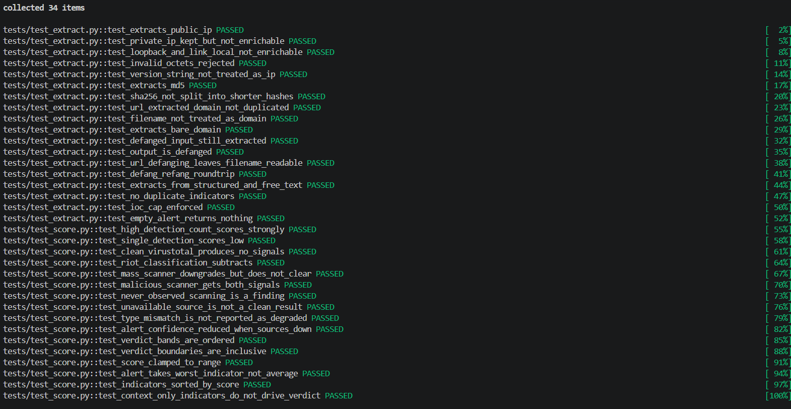

# Alert Triage Engine

Automated first-pass triage for security alerts — extracts indicators of compromise from raw alert text, enriches them against four threat intelligence sources concurrently, scores the result, and produces an analyst-ready case note.

**Live demo:** https://alert-triage-engine.onrender.com/

> Hosted on Render's free tier — the first request after a period of inactivity takes ~50 seconds to wake the instance. Subsequent requests are fast.


---

## The problem

A Tier 1 SOC analyst receives an alert containing an IP address, a domain, or a file hash. To decide whether it matters, they open a browser tab for VirusTotal, another for GreyNoise, another for OTX, check ThreatFox, then manually reconcile four sets of results into a judgement. That loop takes several minutes and repeats dozens of times a shift.

The lookups themselves are mechanical. The judgement is not. This tool automates the mechanical half so the analyst's attention goes to the part that actually needs a human — and leaves an audit trail of exactly which sources said what.

---

## What it does

- **Extracts IOCs** from unstructured alert text — IPv4 addresses, domains, URLs, and file hashes
- **Refangs on input** — analysts routinely write `hxxp://evil[.]com` so the string isn't clickable; the extractor converts these back to their real form before lookup, so defanged indicators aren't silently missed
- **Enriches concurrently** against VirusTotal, GreyNoise, AlienVault OTX, and ThreatFox using `httpx`, so total latency is roughly the slowest single source rather than the sum of all four
- **Caches to disk** in `data/cache/` to avoid burning free-tier API quota on repeated lookups of the same indicator
- **Degrades visibly** — a source that times out, rate-limits, or returns malformed data is reported as unavailable rather than silently treated as clean
- **Scores each indicator** through a transparent signal ledger showing which source contributed what to the final verdict
- **Defangs on output** so the generated case note is safe to paste into a ticketing system
- **Rate-limits per IP** and caps indicators per alert to protect upstream API quota

---

## Screenshots

| | |
|---|---|
|  |  |
| Paste raw alert text — no structured format required | A clean indicator: the engine discriminates rather than flagging everything |


The case note is the actual deliverable. Everything upstream of it exists to produce something an analyst can put in a ticket.

---

## Architecture

```
                    Alert text (unstructured)
                              │
                              ▼
                  ┌────────────────────────┐
                  │  Pydantic validation   │  max_length=50000
                  └────────────────────────┘
                              │
                              ▼
                  ┌────────────────────────┐
                  │  Per-IP rate limit     │
                  └────────────────────────┘
                              │
                              ▼
                  ┌────────────────────────┐
                  │  extract.py            │  refang → parse → cap at
                  │  IOC extraction        │  MAX_IOCS_PER_ALERT
                  └────────────────────────┘
                              │
                              ▼
                  ┌────────────────────────┐
                  │  Disk cache lookup     │  data/cache/
                  └────────────────────────┘
                              │  (miss)
                              ▼
            ┌──── intel.py — async fan-out (httpx) ────┐
            │                                          │
      ┌─────┴─────┐  ┌──────────┐  ┌─────┐  ┌─────────┴┐
      │VirusTotal │  │GreyNoise │  │ OTX │  │ThreatFox │
      └─────┬─────┘  └────┬─────┘  └──┬──┘  └────┬─────┘
            │             │           │          │
            └─────────────┴─────┬─────┴──────────┘
                                ▼
                    ┌────────────────────────┐
                    │  score.py              │  signal ledger:
                    │  scoring               │  per-source contribution
                    └────────────────────────┘
                                │
                                ▼
                    ┌────────────────────────┐
                    │  casenote.py           │  defanged output
                    └────────────────────────┘
```

API keys are held server-side in environment variables and are never exposed to the browser. Rate limiting and input validation both sit in front of any upstream call.

### Data flow

1. The static frontend posts raw alert text to the FastAPI backend
2. Pydantic validates and length-bounds the input at the API boundary
3. Per-IP rate limit is checked before any upstream request
4. Indicators are refanged, extracted, and capped at `MAX_IOCS_PER_ALERT`
5. Disk cache is consulted; only cache misses reach the threat intel APIs
6. Enrichment requests fan out concurrently, each independently timeout-bounded
7. Results are normalised, scored, and rendered as a verdict, signal ledger, and defanged case note

---

## Technology stack

| Choice | Why |
|---|---|
| Python | Dominant language for security tooling; strong HTTP and parsing ecosystem |
| FastAPI | Native async support, which the concurrent enrichment design depends on |
| Pydantic v2 | Schema validation at the API boundary, so malformed or oversized input is rejected before it reaches parsing logic |
| httpx | Async HTTP with per-request timeouts and typed exceptions, which the fail-visible design depends on |
| Static `index.html` via `StaticFiles` | The UI is a thin client over the API; a template engine or frontend framework would add build complexity without adding capability |
| File-based cache | Sufficient at this scope and requires no additional service; a cache server would be operational overhead for a single-instance demo |
| Render | Free tier sufficient for a public demo, with environment-variable secret storage and automatic deploys from GitHub |
| pytest | Unit coverage for the logic that must not silently break — extraction and scoring |

**Considered and rejected:** a database. The tool is stateless by design and stores no alerts, so persistence would add attack surface and operational burden with no functional gain at this scope.

---

## Security design decisions

Each decision is stated with the risk it addresses and what it cost.

### Server-side API key storage

**Decision:** All four API keys live in server-side environment variables. No key is sent to the browser.

**Why:** Any credential reachable by client-side code is a public credential. Free-tier threat intel quotas are exhaustible, so an exposed key is both a confidentiality problem and a denial-of-service problem for the tool itself.

**Trade-off:** Every enrichment request round-trips through the backend rather than going direct from the browser.

### Two-layer input bounding

**Decision:** Input is capped twice — `max_length=50000` on the submitted text via Pydantic, and `MAX_IOCS_PER_ALERT` on the number of indicators actually processed.

**Why:** These defend different assets. The character limit protects server CPU from oversized or adversarial input hitting a regex-based extractor. The IOC cap protects the API keys: 50,000 characters could contain a thousand IP addresses, and without the second limit a single paste would fan out into a thousand upstream calls and drain the daily quota in one request. Bounding the input alone would not have prevented that.

**Trade-off:** Very large alert dumps must be split, and only the first N indicators in an alert are enriched.

### Per-IP rate limiting

**Decision:** The enrichment endpoint enforces a per-source-IP request limit.

**Why:** The endpoint is unauthenticated and public. Without a limit, anyone could point a script at it and use my API quota as a free threat intel proxy, taking the demo offline for everyone else. The asset being protected here is quota, not information.

**Trade-off:** Users behind a shared corporate NAT or university gateway share one apparent IP and may hit the limit collectively.

### Fail-visible, not fail-open

**Decision:** Each enrichment client handles timeouts, HTTP status errors, transport errors, and malformed responses as distinct cases. A source that fails is marked unavailable and excluded from scoring — never counted as a clean result.

**Why:** This is the most consequential decision in the project. If a failed VirusTotal lookup were treated as "nothing found," an API outage would silently turn every malicious indicator benign — a security tool confidently producing wrong answers. Visible degradation is recoverable; silent degradation is not.

**Trade-off:** The analyst sometimes sees a partial verdict and has to complete the check manually. That is the correct outcome.

### Defanging on output

**Decision:** Indicators in the generated case note are defanged — `http` becomes `hxxp`, dots in the host are bracketed.

**Why:** The case note is designed to be pasted into a ticket, an email, or a chat channel, all of which auto-linkify URLs. A live malicious URL rendered as a clickable link inside an incident ticket is a hazard to every analyst who opens that ticket afterwards. The tool refangs on the way in so nothing is missed, and defangs on the way out so nothing is accidentally clicked.

**Trade-off:** Anyone wanting the raw indicator has to refang it manually — which is the intended friction.

### No authentication — a deliberate choice

**Decision:** No user accounts, no login, no sessions.

**Why:** Authentication exists to protect something — stored data, user-specific state, privileged actions. This application has none. It holds no user records, persists no submitted alerts, and every user gets identical functionality. Adding a login would mean storing credentials, creating a genuine breach consequence where none currently exists. Rate limiting is the compensating control for the abuse risk that does exist.

**Trade-off:** The service cannot attribute usage, offer per-user quotas, or be deployed as-is inside an organisation.

**Before this handled real production alerts it would need:** authentication with hashed credentials, per-user rate limits, audit logging, and encryption of cached data — because at that point the alerts describe an organisation's internal network and become sensitive material in their own right.

<!-- VERIFY BEFORE PUBLISHING: check your CORSMiddleware config in src/api.py.
     If allow_origins is ["*"], add a decision block here explaining why that is
     acceptable for a read-only, unauthenticated, rate-limited public demo — and
     what you would change for a real deployment. If it is restricted, say so. -->

---

## Threat model

Assets: the four API keys, service availability, and the integrity of the verdict.

| Threat (STRIDE) | Scenario | Mitigation |
|---|---|---|
| Denial of service | Automated abuse exhausts free-tier API quota, disabling the tool | Per-IP rate limiting; `MAX_IOCS_PER_ALERT`; disk caching reduces upstream calls |
| Denial of service | Oversized or adversarial input causes excessive parsing cost | `max_length=50000` enforced by Pydantic before extraction runs |
| Information disclosure | API keys extracted from client-side code | Keys held server-side only; the frontend never sees them |
| Spoofing | An upstream source is unreachable and its silence is read as "clean" | Fail-visible design — unavailable sources are excluded from scoring and shown as unavailable |
| Tampering | Malformed input manipulates extraction to produce a false verdict | Strict indicator patterns; unmatched content discarded rather than passed through |
| Elevation of privilege (analyst-side) | Live malicious URL becomes clickable inside the ticketing system | Output defanging in `casenote.py` |
| Repudiation | No record of who submitted what | **Accepted, not mitigated** — the service is anonymous by design and stores no submissions. Would require authentication and audit logging |

<!-- VERIFY BEFORE PUBLISHING: check what goes into detail= on the HTTPException
     raises in src/api.py (~lines 170, 177). If any upstream exception string is
     passed through, add an "Information disclosure — error messages" row here
     describing what you did about it. If they are already generic, add a row
     saying error responses are generic by design. -->

---

## Limitations — what this is not

- **It does not ingest from a SIEM.** Alerts are pasted manually. Real deployment would need a connector to pull from the alert queue.
- **It is single-tenant and stateless.** No case history, no assignment, no analyst workflow — this is the enrichment step, not a case management system.
- **Enrichment quality is bounded by free-tier API limits.**
- **Test coverage is partial.** `tests/` covers extraction and scoring. The enrichment layer is untested because it depends on live external APIs and would need mocked HTTP responses to test properly.
- **Verdicts are advisory.** The scoring is transparent precisely so an analyst can disagree with it. It reduces lookup time; it does not replace judgement.
- **The public demo has no authentication**, so it suits demonstration and already-public indicators — not real alerts from a live environment.

---

## Installation

```bash
git clone https://github.com/akshatjain2953-source/Alert-Triage-Engine.git
cd Alert-Triage-Engine

python -m venv venv
# Windows
.\venv\Scripts\Activate.ps1
# macOS / Linux
source venv/bin/activate

pip install -r requirements.txt
```

## Configuration

Copy `.env.example` to `.env` and populate it. All four keys have free tiers.

| Variable | Source |
|---|---|
| `VIRUSTOTAL_API_KEY` | virustotal.com — Profile → API Key |
| `GREYNOISE_API_KEY` | greynoise.io — Community API |
| `OTX_API_KEY` | otx.alienvault.com — Settings → OTX Key |
| `THREATFOX_API_KEY` | threatfox.abuse.ch — auth key via account |

`.env` is gitignored. Never commit it.

## Running

```bash
uvicorn src.api:app --reload
```

Then open http://localhost:8000

---

## Testing

34 unit tests across `tests/test_extract.py` and `tests/test_score.py`, covering IOC extraction and scoring — the two components where a silent regression would produce confidently wrong verdicts.

```bash
pytest -v
```



---

## What I learned

**Failure handling is a security decision, not just an engineering one.** The enrichment layer ended up with separate handling for timeouts, HTTP status errors, transport errors and malformed responses, and the reason is that collapsing them into one generic `except` would let an API outage quietly produce clean verdicts on malicious indicators. A security tool that fails quietly is worse than one that fails loudly, because people keep trusting it.

**Rate limiting was not enough on its own.** Capping request frequency per IP still left a single request able to trigger hundreds of upstream calls. Adding `MAX_IOCS_PER_ALERT` was the point where I started thinking about controls in terms of *which asset each one protects* rather than just adding controls.

**"Add authentication" is not automatically the secure answer.** Working through what a login would actually protect here — and realising it would create a credential store where none existed — was where threat modelling stopped being a checklist and started being useful.

---

## Roadmap

- SIEM connector to pull alerts from a queue instead of manual paste
- Mocked-HTTP tests for the enrichment layer
- Authentication, per-user quotas and audit logging as a precondition for handling real alerts
- Persistence with case history and analyst assignment
- Additional enrichment sources (Shodan, URLhaus)
- MITRE ATT&CK technique mapping on the case note
- Containerisation and a CI pipeline with dependency and secret scanning

---

## License

MIT